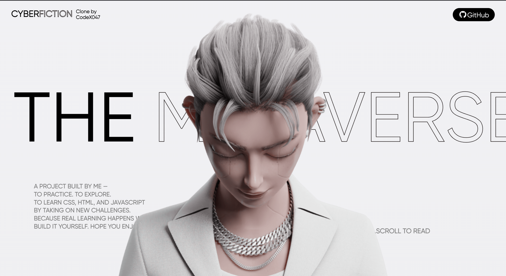
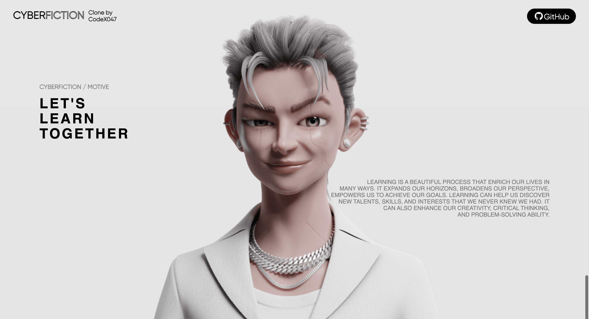

# CyberFiction Clone

  

A **3D-inspired** and **scroll-animated** website clone of the [Cyberfiction Project on Awwwards](https://www.awwwards.com/sites/cyberfiction), built to practice and improve skills in **HTML**, **CSS**, and **JavaScript**.  
This project was made purely for **educational purposes** — to challenge myself, explore advanced animations, and learn modern web design techniques.

---

## 🚀 Live Demo
[View Live Project](https://codex047.github.io/cyberfiction-clone/)

---

## 📌 Features
- Smooth **scroll-based animations** with [GSAP ScrollTrigger](https://greensock.com/scrolltrigger/).
- **Locomotive Scroll** for buttery smooth scrolling effects.
- Custom **gradient backgrounds** and **looping text animations**.
- Clear typography hierarchy and minimalistic aesthetic.

---

## 🛠️ Technologies Used

---

## 📚 Learning Goals
- Deepen understanding of **CSS animations** and **layout techniques**.
- Work with **JavaScript animation libraries** like GSAP.
- Learn **scroll-triggered effects** and **smooth scrolling integration**.
- Improve **code structure** and **project organization**.

---

## 📷 Screenshots
<!-- Add your screenshots here -->

---

## 💡 Personal Note
> _"A project made by me to practice and learn new things about CSS, HTML, and JavaScript.  
> You learn the most when you build it yourself — I hope you enjoy my work!"_

---

## 📄 License
This project is for educational purposes only and is **not** intended for commercial use. All design credit goes to the original [Cyberfiction](https://www.awwwards.com/sites/cyberfiction) creators.